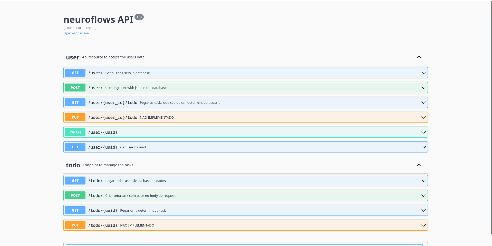

# NeuroFlow

  

# Motivação

Temos que o neuroflows é um projeto de autoria própria, focado criar uma aplicação web monolítica, usando tecnologias consolidadas e
que são consideradas fundamentais no mercado, e usando tecnologias que são emergentes para o desenvolvimento de uma aplicação mobile que funcione lado a lado com nossa aplicação web
A aplicação foi feita com o intuito de criar ferramentas de uso comum por estudantes tanto de nivel médio como nível superior, de forma 
que essas ferramentas sejam de fácil acesso, e que o nosso usuário tenha maior facilidade na forma como pode acessar suas informações, e suas anotações

## Features do Projeto
Como feature do projeto, algumas funcionalidades existentes que vão ser usadas para facilitar os estudos dos nossos usuários são:

- **Todo:** Feature para listarmos nossas tasks, e poder acompanhar.
- **Note taker:** Tomar notas com base na formatação markdown, e poder visualizar elas de maneira completamente facilitada e formatada

# Tecnologias
Temos que as tecnologias usadas dentro desse projeto e suas definições de uso são as seguintes:

- **Docker:** Criação de container para ambientes de desenvolvimento e produção estáveis
- **Git:** Versionamento de Código
- **MySQL:** Banco de Dados
- **Dbeaver:** Sistema para visualização e manejo de banco de dados
- **Flask:** Servidor web backend
- **SQLAlchemy:** ORM para o banco de dados
- **Pytest:** Ferramenta de construção de Suite de testes
- **Webpack:** Criação de bundle para o front-end
- **Bootstrap:** Framework de Estilização do app
- **Jinja:** Linguagem de Template para criação de interface de aplicações web
- **Python:** Linguagem para desenvolvimento do back-end da aplicação
- **HTML:** Estruturação das Páginas
- **CSS:** Estilização de páginas
- **Javascript:** Dinâmicidade e Interatividade do Usuário

# API

Com as necessidades dos sistemas, e possibilidade de precisar de uma aplicação móvel, foi criado ao lado uma api de forma que usa os mesmos elementos arquiteturais que o sistema original, de forma a não criar mutações e variações de comportamento do sistema, mantendo a consistência

